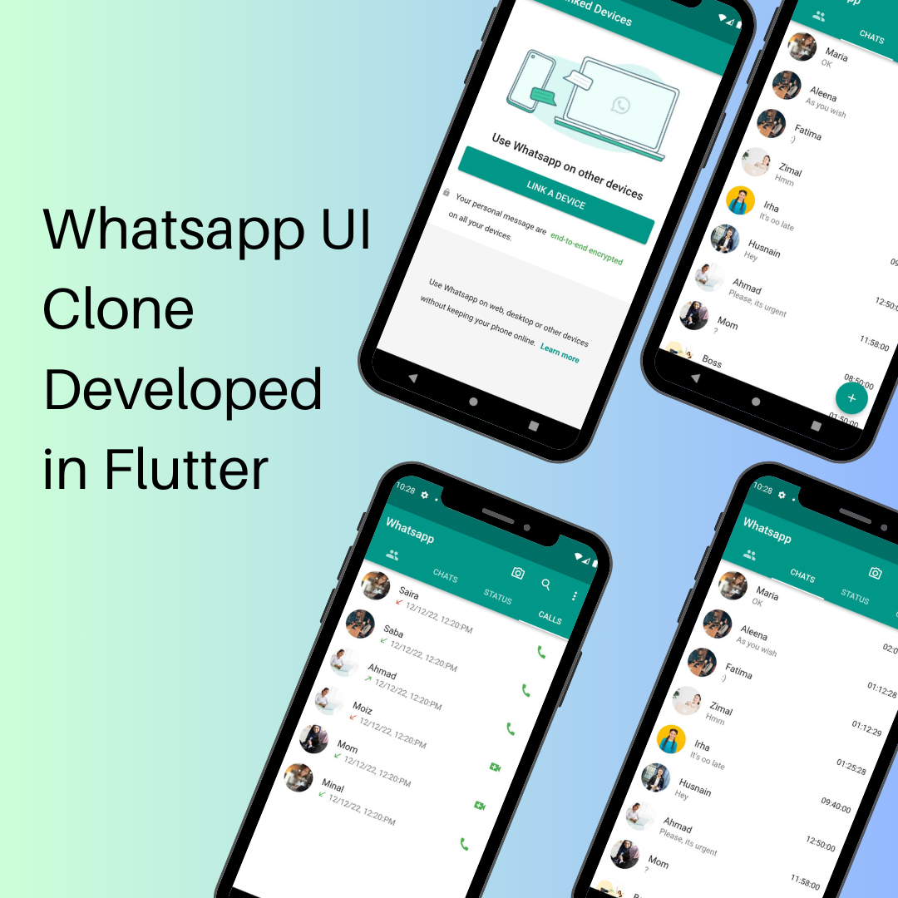

# WhatsApp UI Clone

A **Flutter** application that replicates the WhatsApp user interface using the **MVC architecture**. This frontend-only project uses a **JSON file** to display chat data on various screens.

---

## 📸 Screenshots

---

## ✨ Features

- 📱 WhatsApp-like user interface
- 🗂 Tab-based navigation (Chats, Calls, Status)
- 💬 Display chat messages from a local JSON file
- 🎨 Beautiful UI with Material Design components
- 🏗 Uses **MVC Architecture** for better code organization

---

## 🛠️ Technologies Used

- **Flutter** (Dart)
- **JSON** (for storing chat data locally)
- **MVC Architecture** (Model-View-Controller pattern)
- **Material Design** (for UI components)

---

## 📜 License

This project is **open-source** and available under the [MIT License](LICENSE).

---

## 🤝 Contributing

Contributions are welcome! If you'd like to improve the app, feel free to **fork** the repository and submit a **pull request**.

---

## 📧 Contact

For any inquiries or suggestions, reach out via:
- **GitHub**: [saira-kanwal](https://github.com/saira-kanwal)

---

### ⭐ Don't forget to star the repo if you like this project! ⭐
